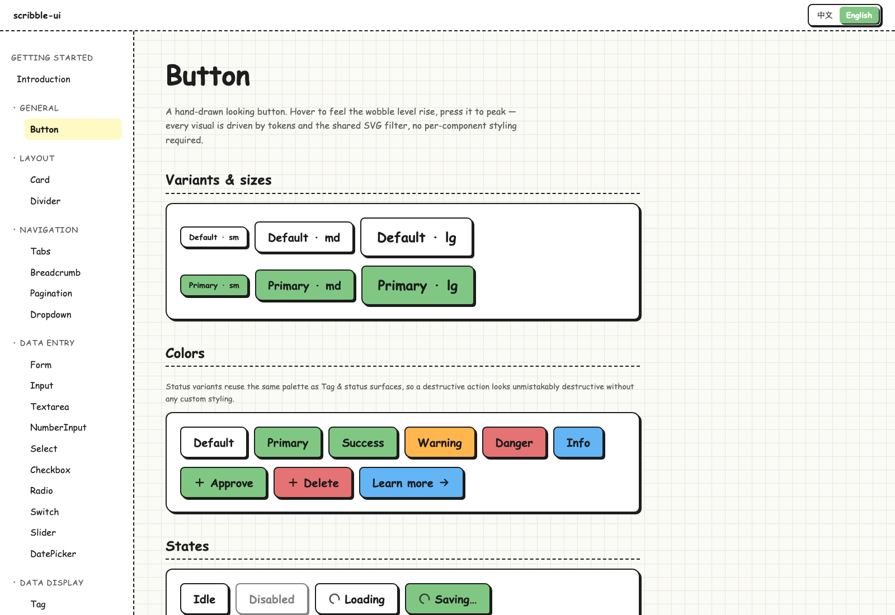

[English](./README.md) | [简体中文](./README.zh-CN.md)

<p align="center">
  
</p>

<h1 align="center">scribble-ui</h1>

<p align="center">
  A hand-drawn React component library — sticky notes meet whiteboard sketches.
</p>

<p align="center">
  
  
  
  
  
</p>

`scribble-ui` ships **34 hand-drawn React components** with a warm, low-corporate aesthetic: sticky-note palette, asymmetric corners, hard offset shadows, and SVG `feTurbulence` wobble. Built for whiteboard tools, note-taking apps, learning products — anywhere you want to dial down the SaaS polish.

## Why scribble-ui

- 🎨 **Hand-drawn by default.** Every stroke wobbles via SVG `feTurbulence` + `feDisplacementMap`, with three jitter levels (`subtle` / `normal` / `strong`).
- 🪧 **Sticky-note palette, never pure black/white.** Off-white canvas, ink-black `#1e1e1e`, and a curated set of pastel tints from the design tokens.
- 🧱 **Asymmetric geometry.** Every corner radius is different, every shadow is a hard offset — no Material elevation, no blurred drop shadows.
- 🪶 **Tiny surface area.** Tree-shakable ESM + CJS + `.d.ts`, zero runtime CSS-in-JS, peer deps are just `react` and `react-dom`. No Tailwind, no styled-components.

## Install

```bash
npm install scribble-ui
# or
pnpm add scribble-ui
# or
yarn add scribble-ui
```

Import the base styles **once** at your app entry:

```ts
import 'scribble-ui/styles/tokens.css';
import 'scribble-ui/styles/components.css';
// optional CSS reset
import 'scribble-ui/styles/reset.css';
```

Then mount `<HandDrawnFilters />` **once** at the root of your app — every component references its filter `id`s by URL, so the SVG `<defs>` must live in the DOM:

```tsx
import { HandDrawnFilters } from 'scribble-ui';

export default function RootLayout({ children }: { children: React.ReactNode }) {
  return (
    <>
      <HandDrawnFilters />
      {children}
    </>
  );
}
```

## Recipes

### 1. Button

```tsx
import { Button } from 'scribble-ui';

<Button variant="primary" size="md" onClick={() => alert('hi')}>
  Click me
</Button>
```

### 2. Form with `react-hook-form` + `zod`

`<Form>` and `<Form.Item>` are intentionally minimal: layout / size context, label, required asterisk, error (`role="alert"`), helper text, automatic `htmlFor`. They do **not** clone children to inject `value` / `onChange` — wire fields up with `Controller` instead, so they stay 100% compatible with RHF's render-prop contract.

```tsx
import { useForm, Controller } from 'react-hook-form';
import { zodResolver } from '@hookform/resolvers/zod';
import { z } from 'zod';
import { Form, Input, Button } from 'scribble-ui';

const schema = z.object({
  email: z.string().email('Please enter a valid email'),
});
type FormValues = z.infer<typeof schema>;

export function SignUp() {
  const { control, handleSubmit, formState: { errors } } = useForm<FormValues>({
    resolver: zodResolver(schema),
    defaultValues: { email: '' },
  });

  return (
    <Form layout="vertical" onSubmit={handleSubmit((v) => console.log(v))}>
      <Form.Item label="Email" required error={errors.email?.message}>
        <Controller
          name="email"
          control={control}
          render={({ field }) => <Input {...field} placeholder="you@example.com" />}
        />
      </Form.Item>
      <Button type="submit" variant="primary">Sign up</Button>
    </Form>
  );
}
```

`react-hook-form` and `zod` are **opt-in** — they're not peer deps. Any controlled component (`<Input>`, `<Select>`, `<DatePicker>`, …) drops into `<Controller>` because they all expose the standard `value` / `onChange` / `error` shape.

### 3. Modal

```tsx
import { useState } from 'react';
import { Button, Modal } from 'scribble-ui';

export function ConfirmDelete() {
  const [open, setOpen] = useState(false);
  return (
    <>
      <Button variant="danger" onClick={() => setOpen(true)}>Delete</Button>
      <Modal
        open={open}
        onClose={() => setOpen(false)}
        header="Delete this note?"
        footer={
          <>
            <Button variant="default" onClick={() => setOpen(false)}>Cancel</Button>
            <Button variant="danger" onClick={() => setOpen(false)}>Delete</Button>
          </>
        }
      >
        This action cannot be undone.
      </Modal>
    </>
  );
}
```

## Components

34 components, grouped by intent:

| Category | Components |
|---|---|
| **General** | Button · Tag · Avatar · Badge · Divider |
| **Forms** | Input · Textarea · NumberInput · Checkbox · Radio · Switch · Select · Slider · DatePicker · Form |
| **Data display** | Card · Tabs · Timeline · Carousel · Pagination · Breadcrumb · Skeleton · Empty · Progress |
| **Feedback** | Modal · Drawer · Toast · Tooltip · Popover · Alert · Result · Spinner |
| **Navigation** | Dropdown · BackTop |
| **Foundation** | HandDrawnFilters *(mount once at the app root)* |

Live demos for every component live in the documentation site — see below.

## Documentation

The docs site is a Next.js 14 App Router project under `apps/docs`, with **i18n** (`en-US` / `zh-CN`) and live demos that import directly from `packages/core` source.

```bash
pnpm install
pnpm dev          # http://localhost:3000
```

## Repository layout

```
scribble-ui/
├── packages/
│   └── core/          # the published `scribble-ui` package
└── apps/
    └── docs/          # Next.js 14 docs site (en-US / zh-CN)
```

## Local development

```bash
# Requires Node >= 20 (see .nvmrc) and pnpm 10.x (see package.json#packageManager)
nvm use
pnpm install

# Start the docs site — live-references packages/core source
pnpm dev

# Build everything (library first, then docs)
pnpm build

# Type-check the entire workspace
pnpm typecheck
```

## Status

34 components shipped, polishing phase. The public API is **not** stable yet — expect breaking changes until `0.1.0`.

## License

MIT
